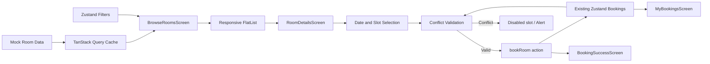
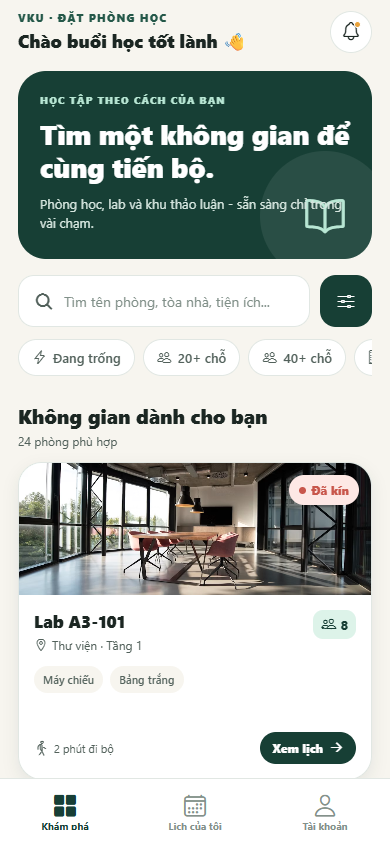
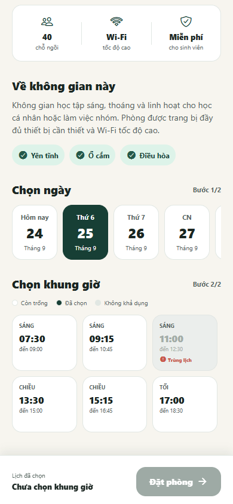
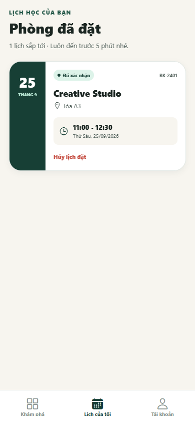

# MINI-PROJECT SHORT TECHNICAL REPORT

**Course:** Cross-Platform Mobile App Development (VKU)  
**Mini-Project Title:** Mini-Project 2 — VKU Room Booking: Study Room Booking App  
**Team / Student Name:** huyvu16 (Individual Project)  
**Submission Date:** 23/09/2026

> **Thông tin cần bổ sung trước khi nộp:** Họ và tên sinh viên, mã số sinh viên và video demo (nếu có).

---

## 1. GENERAL INFORMATION & DELIVERABLE LINKS

* **Team Members:**
  1. **[CẦN BỔ SUNG HỌ VÀ TÊN]** — Student ID: **[CẦN BỔ SUNG MSSV]** — Role: **Individual Developer / UI, Navigation, State Management & Deployment** — Contribution: **100%**
* **🔗 Live Demo URL:** [https://huyvu16.github.io/vku-room-booking/](https://huyvu16.github.io/vku-room-booking/)
* **💻 GitHub Repository:** [https://github.com/huyvu16/vku-room-booking](https://github.com/huyvu16/vku-room-booking)
* **🎥 Video Demo (Optional):** Chưa cung cấp.

### Project Overview

VKU Room Booking là ứng dụng React Native đa nền tảng giúp sinh viên tìm kiếm và đặt phòng học, phòng lab hoặc không gian làm việc nhóm trong khuôn viên VKU. Ứng dụng cung cấp 24 phòng mẫu, bộ lọc nhiều tiêu chí, chọn ngày/khung giờ, phát hiện lịch trùng, quản lý lịch đã đặt và giao diện thích ứng trên điện thoại, máy tính bảng và web.

---

## 2. FEATURE IMPLEMENTATION CHECKLIST

| # | Required Feature | Status | Implementation Details & Acceptance Level |
|---:|---|:---:|---|
| 1 | Room search and multi-criteria filtering | ✅ Complete | Tìm theo tên phòng, tòa nhà, tầng hoặc tiện ích; kết hợp đồng thời trạng thái còn trống, sức chứa 20+/40+, tòa nhà và thiết bị. Kết quả và số lượng phòng được cập nhật ngay trên giao diện. |
| 2 | Optimized room list with `FlatList` | ✅ Complete | Hiển thị 24 phòng bằng `FlatList`; `RoomCard` sử dụng `memo`, `renderItem` dùng `useCallback`, dữ liệu lọc dùng `useMemo`; cấu hình `initialNumToRender`, `maxToRenderPerBatch`, `windowSize`, `updateCellsBatchingPeriod` và `removeClippedSubviews`. |
| 3 | Date/time-slot selector and conflict prevention | ✅ Complete | Người dùng chọn ngày và một trong 6 khung giờ. Slot đã được phòng sử dụng hoặc trùng với lịch cá nhân bị vô hiệu hóa và có nhãn rõ ràng. Store kiểm tra lại xung đột khi xác nhận để tránh đặt trùng. |
| 4 | Stack and Bottom Tabs navigation | ✅ Complete | Native Stack điều hướng `MainTabs → RoomDetails → BookingSuccess`; Bottom Tabs gồm Khám phá, Lịch của tôi và Tài khoản. Route params được định kiểu bằng TypeScript. |
| 5 | Client state and simulated server state | ✅ Complete | Zustand quản lý bộ lọc, lịch đặt và hành động hủy/đặt phòng. TanStack Query quản lý dữ liệu phòng mô phỏng, cache 5 phút, retry một lần và hỗ trợ tải lại khi lỗi. |
| 6 | Booking management flow | ✅ Complete | Có luồng xem chi tiết → chọn lịch → xác nhận → màn hình thành công → danh sách lịch đã đặt. Người dùng có thể hủy một lịch đã xác nhận. |
| 7 | Responsive, safe-area and PWA support | ✅ Complete | Bố cục 1/2/3 cột theo độ rộng màn hình, hỗ trợ safe area, tablet và xoay màn hình. Bản web có manifest, icon 192/512 px và chế độ standalone để cài lên màn hình chính. |

### Acceptance Verification

| Verification | Result | Evidence |
|---|:---:|---|
| `npm run typecheck` | ✅ Passed | TypeScript strict mode không phát hiện lỗi kiểu dữ liệu. |
| `npx expo install --check` | ✅ Passed | Các package tương thích với Expo SDK hiện tại. |
| `npm run export:web` | ✅ Passed | Metro tạo production web bundle gồm 651 modules và 30 assets. |
| `npm run deploy` | ✅ Passed | Bản web được xuất bản thành công lên GitHub Pages. |
| Live smoke test | ✅ Passed | Đã kiểm tra các luồng duyệt phòng, lọc, xem chi tiết, phát hiện trùng lịch và xem lịch đã đặt; không có console error hoặc failed request trong lần kiểm tra cuối. |

---

## 3. TECHNICAL ARCHITECTURE & PROJECT STRUCTURE

### 3.1. Tech Stack

* **Framework:** React Native 0.86, Expo SDK 57 (Managed Workflow), React 19.
* **Language:** TypeScript với strict mode.
* **Navigation:** React Navigation 7, Native Stack và Bottom Tabs.
* **Client State:** Zustand 5.
* **Server State:** TanStack Query 5 với nguồn dữ liệu mô phỏng.
* **UI:** React Native core components, Expo Vector Icons và React Native Safe Area Context.
* **Web/PWA:** React Native Web, Expo Web, Web App Manifest và GitHub Pages.

### 3.2. Directory Structure

```text
Mini-project2/
├── App.tsx                         # Root providers và AppNavigator
├── app.json                        # Cấu hình Expo, Android, iOS và Web
├── assets/
│   └── app-icon.png                # Icon nguồn của ứng dụng
├── public/
│   ├── index.html                  # Metadata và liên kết PWA
│   └── manifest.json               # Cấu hình cài ứng dụng trên web
├── scripts/
│   ├── generate-pwa-icons.mjs      # Sinh icon PWA 192/512 px
│   └── prepare-web-dist.mjs        # Giữ runtime assets khi deploy Pages
├── src/
│   ├── api/
│   │   └── rooms.ts                # TanStack Query và simulated API
│   ├── components/
│   │   ├── FilterChip.tsx          # Chip lọc có trạng thái chọn
│   │   └── RoomCard.tsx            # Card phòng được memo hóa
│   ├── data/
│   │   └── rooms.ts                # 24 phòng và 6 khung giờ mẫu
│   ├── hooks/
│   │   └── useResponsiveLayout.ts  # Bố cục 1/2/3 cột
│   ├── navigation/
│   │   ├── AppNavigator.tsx        # Stack + Bottom Tabs
│   │   └── types.ts                # Typed navigation params
│   ├── screens/
│   │   ├── BrowseRoomsScreen.tsx   # Tìm kiếm, lọc và danh sách phòng
│   │   ├── RoomDetailsScreen.tsx   # Chi tiết, ngày và time slots
│   │   ├── BookingSuccessScreen.tsx
│   │   ├── MyBookingsScreen.tsx    # Danh sách và hủy lịch
│   │   └── ProfileScreen.tsx
│   ├── store/
│   │   └── useBookingStore.ts      # Filter, booking và conflict rules
│   ├── utils/
│   │   └── date.ts                 # Chuẩn hóa và hiển thị ngày
│   ├── theme.ts                    # Color tokens và border radius
│   └── types.ts                    # Domain models
└── docs/screenshots/               # Ảnh minh chứng của báo cáo
```

### 3.3. State/Data Flow



Luồng dữ liệu phòng được tách khỏi trạng thái tương tác của người dùng. TanStack Query đảm nhiệm dữ liệu có tính chất server state, còn Zustand giữ bộ lọc và lịch đặt dùng chung giữa các màn hình. Việc tách này giúp component tập trung vào hiển thị và làm rõ nơi thực thi từng quy tắc nghiệp vụ.

### 3.4. Error Handling and Defensive Logic

* Màn hình danh sách có trạng thái loading, empty và error; khi lỗi người dùng có thể chọn **Thử lại** để gọi `refetch()`.
* Ảnh phòng từ Unsplash có fallback cục bộ khi không tải được.
* Màn hình chi tiết xử lý trường hợp không tìm thấy phòng và ngăn xác nhận khi chưa chọn khung giờ.
* Slot không khả dụng và slot trùng lịch bị disabled trên UI; `bookRoom()` tiếp tục kiểm tra xung đột tại store để tránh phụ thuộc hoàn toàn vào giao diện.
* Navigation params, room model, time slot, booking và filter đều có TypeScript types riêng.

---

## 4. EMPIRICAL EVIDENCE & SCREENSHOTS

Các ảnh dưới đây được chụp ở viewport mobile `390 × 844` trực tiếp từ bản live GitHub Pages ngày 24/09/2026.

### Figure 1 — Room Discovery and Responsive FlatList



*Màn hình Khám phá hiển thị thanh tìm kiếm, các filter chip và danh sách 24 phòng. Room card thể hiện ảnh, trạng thái, vị trí, sức chứa, tiện ích và nút xem lịch.*

### Figure 2 — Multi-Parameter Filtering


*Hai điều kiện “Đang trống” và “20+ chỗ” được bật đồng thời. Badge trên nút lọc hiển thị 2 điều kiện, số kết quả giảm còn 12 và người dùng có thể xóa toàn bộ bộ lọc.*

### Figure 3 — Time-Slot Selection and Conflict Prevention



*Time-slot selector chia quy trình thành chọn ngày và chọn giờ. Slot 11:00–12:30 bị vô hiệu hóa với nhãn “Trùng lịch” vì đã tồn tại một booking cùng thời điểm.*

### Figure 4 — Confirmed Booking Management



*Tab “Lịch của tôi” hiển thị booking đã xác nhận với mã booking, phòng, tòa nhà, ngày, giờ và thao tác hủy lịch.*

---

## 5. TECHNICAL CHALLENGES & RESOLUTIONS

### 5.1. Rendering a Large, Responsive Room Feed

**Challenge:** Danh sách cần hoạt động mượt trên điện thoại nhưng vẫn tận dụng không gian trên tablet và web. Việc render toàn bộ card cùng lúc hoặc đặt chiều rộng cố định sẽ gây lãng phí tài nguyên và vỡ bố cục.

**Resolution:** Sử dụng `FlatList` thay cho `ScrollView` để ảo hóa danh sách, giới hạn batch render và clipping các item ngoài viewport. `useWindowDimensions()` tính số cột theo ba breakpoint: 1 cột dưới 600 px, 2 cột từ 600 px và 3 cột từ 900 px. Card được memo hóa và callback mở chi tiết được giữ ổn định.

### 5.2. Preventing Double Booking Across Rooms

**Challenge:** Một khung giờ có thể không khả dụng vì phòng đã được sử dụng hoặc vì người dùng đã đặt một phòng khác cùng thời điểm. Chỉ disable nút trên UI chưa đủ vì trạng thái có thể thay đổi trước khi xác nhận.

**Resolution:** Kết hợp hai nguồn kiểm tra: `unavailableSlotsByDay` của phòng và `hasConflict(date, slotId)` của Zustand. UI giải thích rõ trạng thái bằng màu/nhãn, đồng thời action `bookRoom()` kiểm tra lại lần cuối và trả về `BookingResult` gồm `ok` và `reason`.

### 5.3. Deploying Expo Web Assets to a Repository Subpath

**Challenge:** GitHub Pages phục vụ ứng dụng dưới `/vku-room-booking/`. Ngoài base URL, công cụ deploy ban đầu giữ `.gitignore` của repository nên bỏ qua các font do Expo xuất vào đường dẫn `assets/node_modules`, làm icon không tải được.

**Resolution:** Cấu hình `experiments.baseUrl` cho repository subpath, thêm bước `prepare-web-dist.mjs` để tạo `.gitignore` phù hợp trong web artifact và deploy với tùy chọn `--dotfiles --nojekyll`. Sau khi triển khai lại, toàn bộ font/runtime assets có mặt trên nhánh Pages và live smoke test không còn failed request.

### 5.4. Current Limitations and Next Steps

* Dữ liệu phòng và lịch đặt hiện nằm trong bộ nhớ, chưa kết nối database hoặc REST API thật.
* Chưa có đăng nhập, phân quyền quản trị viên và đồng bộ booking giữa nhiều thiết bị.
* Chưa có bộ unit test/E2E tự động; phiên bản hiện tại được kiểm tra bằng TypeScript, Expo dependency check, production export và live smoke test.
* Bước tiếp theo là tích hợp backend, persistence, xác thực người dùng, push notification nhắc lịch và EAS Build cho Android/iOS.

---

**Conclusion:** Mini-Project 2 đã đáp ứng luồng cốt lõi của một ứng dụng đặt phòng đa nền tảng: khám phá và lọc phòng, xem chi tiết, chọn thời gian, ngăn lịch trùng, xác nhận và quản lý booking. Kiến trúc tách navigation, server state, client state và UI components giúp mã nguồn rõ ràng, dễ mở rộng cho backend thật trong giai đoạn tiếp theo.
